### Need for  K8s

 1. _**High Availability (HA)**_ :
    + When we run our applications in  docker container and if the container fails, we need to manually start the container
    + If the node i.e. the machine fails all the containers running on the machine should be re-created on other machine
    + K8s can do both of the above
 2. _**Autoscaling**_
    + Containers don’t scale on their own.
    + Scaling is of two types
        + Vertical Scaling
        + Horizontal Scaling
    + K8s can do both horizontal and vertical scaling of containers
 3. _**Zero-Down time**_
    + K8s can handle  deployments with near zero-down time deployments
    + K8s can handle rollout (new version) and roll back (undo new version => previous version)
 4.  K8s is described as _**Production grade Container management**_

### History

* Google had a history of running everything on containers.
* To manage these containers, Google has developed container management tools (inhouse)
    + Borg
    + Omega
* With  Docker publicizing containers, With the experience in running and managing containers, Google has started a project,  _**Kubernetes (developed in Go)**_ and then handed it over to _**Cloud Native Container Foundation (CNCF)**_

#### Competetiors

* Apache Mesos
* Hashicorp Nomad
* Docker Swarm
* But K8s is clear winner

#### Terms

1. Distributed System
2. Node
3. Cluster
4. State
5. Stateful Applications
6. Stateless Applications
7. Monolith
8. Microservices
9. Desired State
10. Declarative vs Imperative
11. Pet Vs Cattle

###  K8s is not designed only for  Docker

* Initially k8s used  docker as a main container platform and docker used to get special treatment, from k8s 1.24 special treatment is stopped
* k8s is designed to run any container technology, for this  k8s expects container technology to follow k8s interfaces

### K8s Architecture

* Official Architecture image

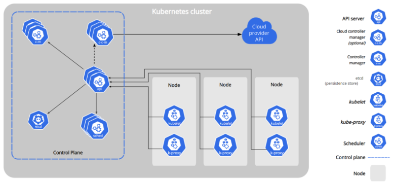

* Other easier representations
* Master Node

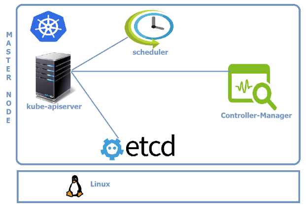

* Node

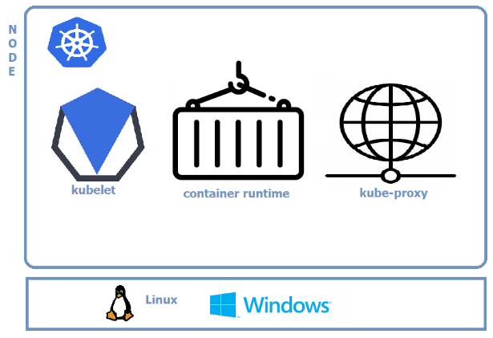

* Clients
    + kubectl
    + any rest based client

* Logical view

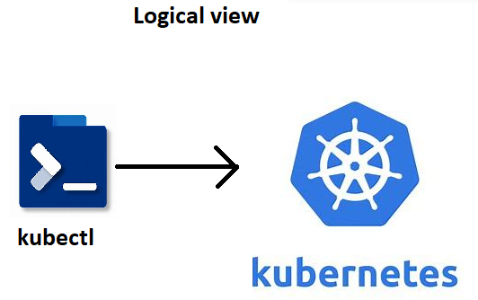

### Kubernetes Components

* For the  k8s components article

    [ Refer Here : https://directdevops.blog/2019/10/10/kubernetes-master-and-node-components/ ]

* Control plane components (Master Node Components)
    + kube-api server
    + etcd (*)
    + kube-scheduler
    + controller manager
    + cloud controller manager
* Node Components
    + kubelet
    + kube-proxy
    + Container run time (*)

#### Kube-Api

* Handles all the communication of k8s cluster
* Let it be internal or external
* kube-api  server exposes functionality over HTTP(s) protocol and provides REST  API

#### Etcd

* For etcd

    [ Refer Here : https://etcd.io/ ]
* This is memory of k8s cluster

#### Scheduler

* Scheduler is responsible for creating  k8s objects and scheduling them on right node

#### Controller

* Controller Manger is responsible for maintaining desired state
* This reconcilation loop that checks for desired state and if it mis matches doing the necessary steps is done by controller

#### Kubelet

* This is an agent of the control plane

#### Container Runtime

* Container technology to be used in  k8s cluster
* in our case it is _**docker**_

#### Kube-Proxy

* This component is responsible for networking for containers on the node

#### kubectl

* This is command line that can be installed on the machine from which you communicate to k8s cluster 
* This tool is created to make communication with api-server simplified
* Kubectl has a config file (KUBECONFIG) which contains
    + api-server information
    + keys to communicate with  api  server
* Kubectl allows to communication with cluster to create resources
    * _**imperatively**_ : Type commands
    * _**declartively**_ : Write manifests (YAML files)
* Reads manifests and connects to  api server. Converts the manifest into REST API calls over JSON

### What is k8s manifest

* This is a yaml file which describes the desired state of what you want in/using  k8s cluster

### CI/CD Workflow

* Basic Workflow

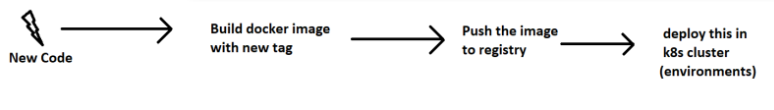

* Jenkins

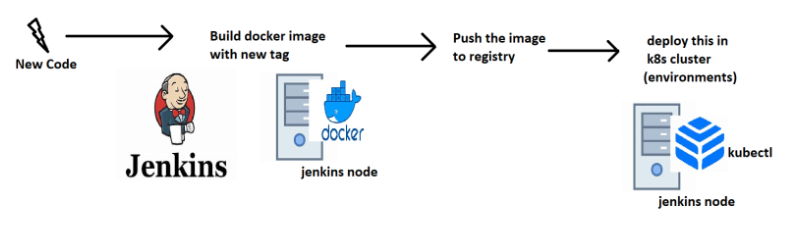

* Azure DevOps

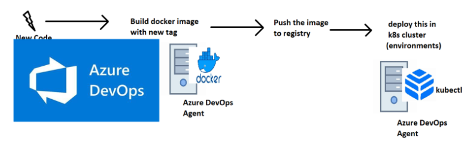

### IDEAL K8s HA-Cluster

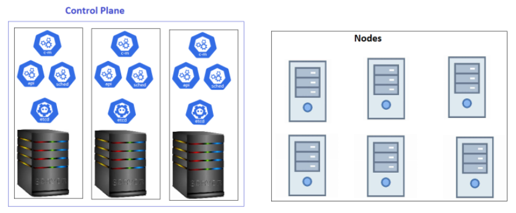

### Kubernetes as a Service

* All popular clouds are offering k8s as a service
    + AKS (Azure K8s service)
    + EKS (Elastic K8s Service)
    + GKE (Google K8s engine)
* All cloud providers manage control plane for you and they charge hourly. For nodes we pay the similar costs of virtual machines

### K8s Installations

* Single Node Installations
    + minikube
    + kind
* On-prem installations
    + kube-admin
* k8s as a Service
    + AKS
    + EKS
    + GKE
* Playground (for learning): 

    [ Refer Here : https://labs.play-with-k8s.com/ ]

#### Installing k8s cluster on ubuntu vms

* Create 3 ubuntu vms which are accesible to each other with atlest 2 vCPUS and 4 GB RAM
* Installation method (kubeadm) which is something we will be using in on-premises k8s.
* For kubeadm installation on single master node

    [ Refer Here : https://kubernetes.io/docs/setup/production-environment/tools/kubeadm/install-kubeadm/ ]

#### Steps

* Install docker on all nodes
* Install CRI-Dockerd 

    [ Refer Here : https://github.com/Mirantis/cri-dockerd ]

* Run the below commands as root user in all the nodes
```
# Run these commands as root
###Install GO###
wget https://storage.googleapis.com/golang/getgo/installer_linux
chmod +x ./installer_linux
./installer_linux
source ~/.bash_profile

git clone https://github.com/Mirantis/cri-dockerd.git
cd cri-dockerd
mkdir bin
go build -o bin/cri-dockerd
mkdir -p /usr/local/bin
install -o root -g root -m 0755 bin/cri-dockerd /usr/local/bin/cri-dockerd
cp -a packaging/systemd/* /etc/systemd/system
sed -i -e 's,/usr/bin/cri-dockerd,/usr/local/bin/cri-dockerd,' /etc/systemd/system/cri-docker.service
systemctl daemon-reload
systemctl enable cri-docker.service
systemctl enable --now cri-docker.socket
```
* Installing kubadm, kubectl, kubelet 

    [ Refer Here : https://kubernetes.io/docs/setup/production-environment/tools/kubeadm/install-kubeadm/#installing-kubeadm-kubelet-and-kubectl ]

* Now create a cluster from a master node 

    [ Refer Here : https://kubernetes.io/docs/setup/production-environment/tools/kubeadm/create-cluster-kubeadm/ ]

* Use the command `kubeadm init --pod-network-cidr "10.244.0.0/16" --cri-socket "unix:///var/run/cri-dockerd.sock"`
* Setup kubeconfig
* Install flannel `kubectl apply -f https://github.com/flannel-io/flannel/releases/latest/download/kube-flannel.yml`
* As a root user run kubeadm join commands (need to pass crisocket)
* Now from manager execute `kubectl get nodes`


### PODS
#### Imperative Way to manage k8s objects

* For official doc's

    [ Refer Here : https://kubernetes.io/docs/tasks/manage-kubernetes-objects/imperative-command/ ]


### Pod lifecycle

* K8s Pods will have following states :
 1. Pending
 2. Running
 3. Succeded
 4. Failed
 5. Unknown

### Container States in k8s pod

 1. Waiting
 2. Running
 3. Terminated

* For container states

    [ Refer here : https://kubernetes.io/docs/concepts/workloads/pods/pod-lifecycle/#container-states ]

* IN pods we can specify container restart policy 

    [ Refer Here : https://kubernetes.io/docs/concepts/workloads/pods/pod-lifecycle/#restart-policy ]

### Container restart policy

* Let's try to create a short lived contianer with different restart policies
* for manifests with restartPolicy

    [ Refer here : https://github.com/asquarezone/KubernetesZone/commit/f136484d376b15c1a984a6d3058cc33e51615709 ]

    + always (Default)


    + never


    + exit code => success
    + exit code => failure


### Controllers in K8s

* Controllers are k8s objects which run other k8s resources. This k8s resource will be part of specification generally in template section.
* Controllers maintain desired state.
* Some of the controllers are :
    + Replication Controller/Replica Set
    + Stateful Sets
    + Deployments
    + Jobs
    + Cron Jobs
    + Daemonset

### K8s Jobs

* For official doc's

    [ Refer Here : https://kubernetes.io/docs/concepts/workloads/controllers/job/ ]

* K8s has two types of jobs
    + _**Job**_ : Run an activity/script to completion
    + _**CronJob**_ : Run an activity/script to completion at specific time period or intervals
* For the manifests with job and cronjob

    [ Refer here : https://github.com/asquarezone/KubernetesZone/commit/7531d6e0c2a712f287ee41e5d53d94c6af3643ac ]

* For jobs restartPolicy cannot be Always as job will never finish


* Jobs have backoffLimit to limit number of restarts and activeDeadline seconds to limit timeperiod of execution
* Running job and waiting for completion


* Cronjob manifest which we have written create a job every minute and waits for completion


#### Let's go back to Pods

* Let's run a alpine pod


* Now if we want to execute a command in the container of alpine pod


* To access the terminal


* _**Exercise**_ : If we have a pod with 2 container how exec a command on a specific container
* Let's run a pod which run application on some port 


* Now if we want to access the application in container we can do port-forward (not recommended approach)


### Controllers

* Controllers in  k8s control/maintain state of  k8s objects


### ReplicaSet

* For ReplicaSet official doc's

    [ Refer Here : https://kubernetes.io/docs/concepts/workloads/controllers/replicaset/ ]

* ReplicaSet is controller which maintains count of Pods as Desired State

#### RS - Activity1 : Create three nginx pods

* For the  nginx rs manifest without selector

    [ Refer Here : https://github.com/asquarezone/KubernetesZone/commit/77c8c9d804b4a69d9d4df9691dc696a740bf04ab ]

* Temporary workaround for adding selectors. For the changes added

    [ Refer here : https://github.com/asquarezone/KubernetesZone/commit/e52430db3bcf4e92990495741a5f4f1bc95db2ce ]

* Now apply the manifest


* Let's change the replica count


* We can increase (scale out) as well decrease (scale in) the replica count

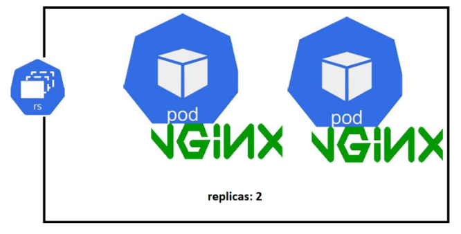

#### RS - Activity2 : Create five Pods with  jenkins and alpine in one Pod

* For the manifest

    [ Refer Here : https://github.com/asquarezone/KubernetesZone/commit/d964fd4084e930a3103e5cc2cf3ecb1978763459 ]

* Apply the manifest


* Get events from describe rs


* Now delete a pod manually


### Labels

* For official doc's

    [ Refer Here : https://kubernetes.io/docs/concepts/overview/working-with-objects/labels/ ]

* Labels are key value pairs that can be attached as metadata to  k8s objects
* Labels help in selecting/querying/filtering objects
* Labels can be selected using
    + equality based 
    
    [ Refer Here : https://kubernetes.io/docs/concepts/overview/working-with-objects/labels/#equality-based-requirement ]

    + set based 
    
    [ Refer Here : https://kubernetes.io/docs/concepts/overview/working-with-objects/labels/#set-based-requirement ]

#### Label - Activity 1 : Create a  nginx pod with label

* Let's create a  nginx pod with label `app: nginx`
* For the pod spec with labels

    [ Refer Here : https://github.com/asquarezone/KubernetesZone/commit/033ced70c7020ca9f843439dd42c9b4243fcb335 ]

* Let's run some other pods using declartative


* Selectors


* Create 5 pods with label app=jenkins


* Now run the replicaset with 5 replicas
```
---
apiVersion: apps/v1
kind: ReplicaSet
metadata:
  name: jenkins-rs
spec:
  minReadySeconds: 5
  replicas: 5
  selector:
    matchLabels:
      app: jenkins
  template:
    metadata:
      name: jenkins
      labels:
        app: jenkins
    spec:
      containers:
        - name: jenkins
          image: jenkins/jenkins:lts-jdk11
          ports:
            - containerPort: 8080
        - name: alpine
          image: alpine:3
          args:
            - sleep
            - 1d
```
*  Jenkins rs didnt create any pod as there were 5 pods matching label selector. we had deleted one pod which lead to creation of  jenkins pod from the template section in above manifest


* Replication Controller only allows equality based selectors where as Replica Set supports set based selectors also
* Sample
```
---
apiVersion: apps/v1
kind: ReplicaSet
metadata:
  name: setbased
  labels:
    purpose: understanding
    concept: setbased
spec:
  minReadySeconds: 2
  replicas: 3
  selector:
    matchExpressions:
      - key: app
        operator: In
        values:
          - nginx
          - web
      - key: env
        operator: NotIn
        values:
          - prod
          - uat
      - key: failing
        operator: DoesNotExist
        values:
  template:
    metadata:
      name: nginx
      labels:
        app: nginx
        env: dev
    spec:
      containers:
        - name: nginx
          image: nginx:1.23
          ports:
            - containerPort: 80
```
#### Exercise

* Write a manifest to create
    + nginx replication controller with 3 pods

#### Next Steps

* Service
* InitContainers
* Health Probes
* Managed  K8s

### Kubernetes as a Service ( Managed K8s )

* Every Cloud provider offers `k8s as a service`
    + Azure = AKS
    + AWS = EKS
    + GCP = GKE
* K8s as a service basically means the master nodes will be managed by cloud provider

    + Typical k8s cluster

    

    + K8s as a Service

    

* Advantages :

 1. less administration
 2. nodes can be scaled
 3. inbuilt support for cloud integrations
* In this course we will be using
 1. AKS
 2. EKS

#### Setting up basic k8s cluster in Azure (AKS)

* In this setups we configure kubectl on
    + dev systems
    + build servers

    

* Install kubectl or we can use azure cli to set it up

    [ Refer Here : https://kubernetes.io/docs/tasks/tools/ ]

* Install azure cli: 

    [ Refer Here : https://learn.microsoft.com/en-us/cli/azure/install-azure-cli ]

* Execute `az login`
* For azure aks

    [ Refer here : https://learn.microsoft.com/en-us/azure/aks/learn/quick-kubernetes-deploy-cli ]

* Create a resource group and continue according to doc's 

    [ Refer Here : https://learn.microsoft.com/en-us/azure/aks/learn/quick-kubernetes-deploy-cli#create-a-resource-group ]

#### Exposing Applications running in cluster to externally as well as internally when scaled

* Every pod gets a unique ip and name
* Connecting from one pod to other on the basis of name/ip might not be a good idea as pods are controlled by replicasets or other controllers
* K8s has a service which helps us in connecting to pods with similar behaviour but by using labels
* Each service gets a ip address and this is virtual ip which helps in forwarding traffic to one of the pod based on labels. This ip is called as cluster ip
* Services can be exposed to external world

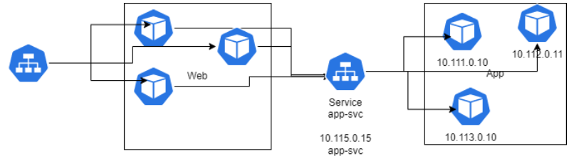

* Service is similar to layer 4 load balancer
* For official doc's

    [  Refer Here : https://kubernetes.io/docs/concepts/services-networking/service/ ]

#### Internal Communication using k8s service

* Consider the following :
    + We have an alpine pod which needs to consume nginx
    + but nginx is a replica set and there can be n replicas
* Let's create a nginx-rs


* Create an alpine pod and login into that


* ping nginx-svc by its ip address and try accessing the web page using curl


* access nginx-svc by using name


* now do nslookup based on name


* Look into environment variables in alpine pod (Alpine was created post nginx service creation)


* Look into environment variables in nginx pods (These were created prior to nginx service)


* For internal communication manifests

    [ Refer Here : https://github.com/asquarezone/KubernetesZone/commit/6b48735bf6627279d4339217f56ca04cff92b76d ]

#### External Communication using k8s service

* Some user external to  k8s cluster wants to access nginx

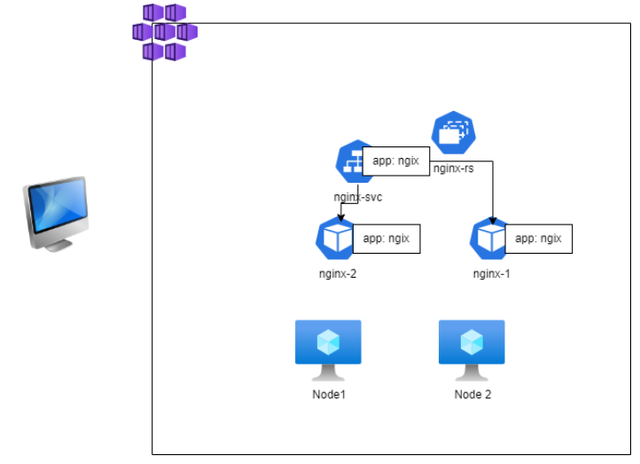

* 


