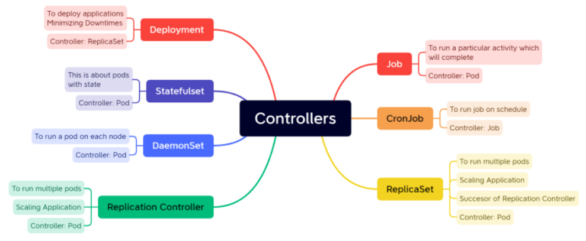
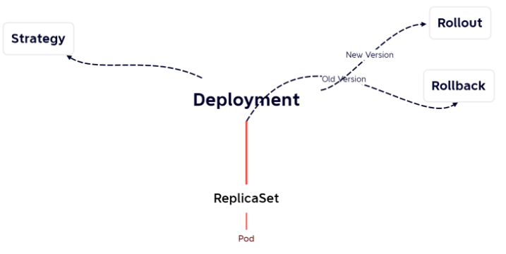

### Need for  K8s

 1. _**High Availability (HA)**_ :
    + When we run our applications in  docker container and if the container fails, we need to manually start the container
    + If the node i.e. the machine fails all the containers running on the machine should be re-created on other machine
    + K8s can do both of the above
 2. _**Autoscaling**_
    + Containers don’t scale on their own.
    + Scaling is of two types
        + Vertical Scaling
        + Horizontal Scaling
    + K8s can do both horizontal and vertical scaling of containers
 3. _**Zero-Down time**_
    + K8s can handle  deployments with near zero-down time deployments
    + K8s can handle rollout (new version) and roll back (undo new version => previous version)
 4.  K8s is described as _**Production grade Container management**_

### History

* Google had a history of running everything on containers.
* To manage these containers, Google has developed container management tools (inhouse)
    + Borg
    + Omega
* With  Docker publicizing containers, With the experience in running and managing containers, Google has started a project,  _**Kubernetes (developed in Go)**_ and then handed it over to _**Cloud Native Container Foundation (CNCF)**_

#### Competetiors

* Apache Mesos
* Hashicorp Nomad
* Docker Swarm
* But K8s is clear winner

#### Terms

1. Distributed System
2. Node
3. Cluster
4. State
5. Stateful Applications
6. Stateless Applications
7. Monolith
8. Microservices
9. Desired State
10. Declarative vs Imperative
11. Pet Vs Cattle

###  K8s is not designed only for  Docker

* Initially k8s used  docker as a main container platform and docker used to get special treatment, from k8s 1.24 special treatment is stopped
* k8s is designed to run any container technology, for this  k8s expects container technology to follow k8s interfaces

### K8s Architecture

* Official Architecture image


* Other easier representations
* Master Node


* Node


* Clients
    + kubectl
    + any rest based client

* Logical view


### Kubernetes Components

* For the  k8s components article

    [ Refer Here : https://directdevops.blog/2019/10/10/kubernetes-master-and-node-components/ ]

* Control plane components (Master Node Components)
    + kube-api server
    + etcd (*)
    + kube-scheduler
    + controller manager
    + cloud controller manager
* Node Components
    + kubelet
    + kube-proxy
    + Container run time (*)

#### Kube-Api

* Handles all the communication of k8s cluster
* Let it be internal or external
* kube-api  server exposes functionality over HTTP(s) protocol and provides REST  API

#### Etcd

* For etcd

    [ Refer Here : https://etcd.io/ ]
* This is memory of k8s cluster

#### Scheduler

* Scheduler is responsible for creating  k8s objects and scheduling them on right node

#### Controller

* Controller Manger is responsible for maintaining desired state
* This reconcilation loop that checks for desired state and if it mis matches doing the necessary steps is done by controller

#### Kubelet

* This is an agent of the control plane

#### Container Runtime

* Container technology to be used in  k8s cluster
* in our case it is _**docker**_

#### Kube-Proxy

* This component is responsible for networking for containers on the node

#### kubectl

* This is command line that can be installed on the machine from which you communicate to k8s cluster 
* This tool is created to make communication with api-server simplified
* Kubectl has a config file (KUBECONFIG) which contains
    + api-server information
    + keys to communicate with  api  server
* Kubectl allows to communication with cluster to create resources
    * _**imperatively**_ : Type commands
    * _**declartively**_ : Write manifests (YAML files)
* Reads manifests and connects to  api server. Converts the manifest into REST API calls over JSON

### What is k8s manifest

* This is a yaml file which describes the desired state of what you want in/using  k8s cluster

### CI/CD Workflow

* Basic Workflow


* Jenkins


* Azure DevOps


### IDEAL K8s HA-Cluster


### Kubernetes as a Service

* All popular clouds are offering k8s as a service
    + AKS (Azure K8s service)
    + EKS (Elastic K8s Service)
    + GKE (Google K8s engine)
* All cloud providers manage control plane for you and they charge hourly. For nodes we pay the similar costs of virtual machines

### K8s Installations

* Single Node Installations
    + minikube
    + kind
* On-prem installations
    + kube-admin
* k8s as a Service
    + AKS
    + EKS
    + GKE
* Playground (for learning): 

    [ Refer Here : https://labs.play-with-k8s.com/ ]

#### Installing k8s cluster on ubuntu vms

* Create 3 ubuntu vms which are accesible to each other with atlest 2 vCPUS and 4 GB RAM
* Installation method (kubeadm) which is something we will be using in on-premises k8s.
* For kubeadm installation on single master node

    [ Refer Here : https://kubernetes.io/docs/setup/production-environment/tools/kubeadm/install-kubeadm/ ]

#### Steps

* Install docker on all nodes
* Install CRI-Dockerd 

    [ Refer Here : https://github.com/Mirantis/cri-dockerd ]

* Run the below commands as root user in all the nodes
```
# Run these commands as root
###Install GO###
wget https://storage.googleapis.com/golang/getgo/installer_linux
chmod +x ./installer_linux
./installer_linux
source ~/.bash_profile

git clone https://github.com/Mirantis/cri-dockerd.git
cd cri-dockerd
mkdir bin
go build -o bin/cri-dockerd
mkdir -p /usr/local/bin
install -o root -g root -m 0755 bin/cri-dockerd /usr/local/bin/cri-dockerd
cp -a packaging/systemd/* /etc/systemd/system
sed -i -e 's,/usr/bin/cri-dockerd,/usr/local/bin/cri-dockerd,' /etc/systemd/system/cri-docker.service
systemctl daemon-reload
systemctl enable cri-docker.service
systemctl enable --now cri-docker.socket
```
* Installing kubadm, kubectl, kubelet 

    [ Refer Here : https://kubernetes.io/docs/setup/production-environment/tools/kubeadm/install-kubeadm/#installing-kubeadm-kubelet-and-kubectl ]

* Now create a cluster from a master node 

    [ Refer Here : https://kubernetes.io/docs/setup/production-environment/tools/kubeadm/create-cluster-kubeadm/ ]

* Use the command `kubeadm init --pod-network-cidr "10.244.0.0/16" --cri-socket "unix:///var/run/cri-dockerd.sock"`
* Setup kubeconfig
* Install flannel `kubectl apply -f https://github.com/flannel-io/flannel/releases/latest/download/kube-flannel.yml`
* As a root user run kubeadm join commands (need to pass crisocket)
* Now from manager execute `kubectl get nodes`


### PODS
#### Imperative Way to manage k8s objects

* For official doc's

    [ Refer Here : https://kubernetes.io/docs/tasks/manage-kubernetes-objects/imperative-command/ ]


### Pod lifecycle

* K8s Pods will have following states :
 1. Pending
 2. Running
 3. Succeded
 4. Failed
 5. Unknown

### Container States in k8s pod

 1. Waiting
 2. Running
 3. Terminated

* For container states

    [ Refer here : https://kubernetes.io/docs/concepts/workloads/pods/pod-lifecycle/#container-states ]

* IN pods we can specify container restart policy 

    [ Refer Here : https://kubernetes.io/docs/concepts/workloads/pods/pod-lifecycle/#restart-policy ]

### Container restart policy

* Let's try to create a short lived contianer with different restart policies
* for manifests with restartPolicy

    [ Refer here : https://github.com/asquarezone/KubernetesZone/commit/f136484d376b15c1a984a6d3058cc33e51615709 ]

    + always (Default)


    + never


    + exit code => success
    + exit code => failure


### Controllers in K8s

* Controllers are k8s objects which run other k8s resources. This k8s resource will be part of specification generally in template section.
* Controllers maintain desired state.
* Some of the controllers are :
    + Replication Controller/Replica Set
    + Stateful Sets
    + Deployments
    + Jobs
    + Cron Jobs
    + Daemonset

### K8s Jobs

* For official doc's

    [ Refer Here : https://kubernetes.io/docs/concepts/workloads/controllers/job/ ]

* K8s has two types of jobs
    + _**Job**_ : Run an activity/script to completion
    + _**CronJob**_ : Run an activity/script to completion at specific time period or intervals
* For the manifests with job and cronjob

    [ Refer here : https://github.com/asquarezone/KubernetesZone/commit/7531d6e0c2a712f287ee41e5d53d94c6af3643ac ]

* For jobs restartPolicy cannot be Always as job will never finish


* Jobs have backoffLimit to limit number of restarts and activeDeadline seconds to limit timeperiod of execution
* Running job and waiting for completion


* Cronjob manifest which we have written create a job every minute and waits for completion


#### Let's go back to Pods

* Let's run a alpine pod


* Now if we want to execute a command in the container of alpine pod


* To access the terminal


* _**Exercise**_ : If we have a pod with 2 container how exec a command on a specific container
* Let's run a pod which run application on some port 


* Now if we want to access the application in container we can do port-forward (not recommended approach)


### Controllers

* Controllers in  k8s control/maintain state of  k8s objects



### ReplicaSet

* For ReplicaSet official doc's

    [ Refer Here : https://kubernetes.io/docs/concepts/workloads/controllers/replicaset/ ]

* ReplicaSet is controller which maintains count of Pods as Desired State

#### RS - Activity1 : Create three nginx pods

* For the  nginx rs manifest without selector

    [ Refer Here : https://github.com/asquarezone/KubernetesZone/commit/77c8c9d804b4a69d9d4df9691dc696a740bf04ab ]

* Temporary workaround for adding selectors. For the changes added

    [ Refer here : https://github.com/asquarezone/KubernetesZone/commit/e52430db3bcf4e92990495741a5f4f1bc95db2ce ]

* Now apply the manifest


* Let's change the replica count


* We can increase (scale out) as well decrease (scale in) the replica count


#### RS - Activity2 : Create five Pods with  jenkins and alpine in one Pod

* For the manifest

    [ Refer Here : https://github.com/asquarezone/KubernetesZone/commit/d964fd4084e930a3103e5cc2cf3ecb1978763459 ]

* Apply the manifest


* Get events from describe rs


* Now delete a pod manually


### Labels

* For official doc's

    [ Refer Here : https://kubernetes.io/docs/concepts/overview/working-with-objects/labels/ ]

* Labels are key value pairs that can be attached as metadata to  k8s objects
* Labels help in selecting/querying/filtering objects
* Labels can be selected using
    + equality based 
    
    [ Refer Here : https://kubernetes.io/docs/concepts/overview/working-with-objects/labels/#equality-based-requirement ]

    + set based 
    
    [ Refer Here : https://kubernetes.io/docs/concepts/overview/working-with-objects/labels/#set-based-requirement ]

#### Label - Activity 1 : Create a  nginx pod with label

* Let's create a  nginx pod with label `app: nginx`
* For the pod spec with labels

    [ Refer Here : https://github.com/asquarezone/KubernetesZone/commit/033ced70c7020ca9f843439dd42c9b4243fcb335 ]

* Let's run some other pods using declartative


* Selectors


* Create 5 pods with label app=jenkins


* Now run the replicaset with 5 replicas
```
---
apiVersion: apps/v1
kind: ReplicaSet
metadata:
  name: jenkins-rs
spec:
  minReadySeconds: 5
  replicas: 5
  selector:
    matchLabels:
      app: jenkins
  template:
    metadata:
      name: jenkins
      labels:
        app: jenkins
    spec:
      containers:
        - name: jenkins
          image: jenkins/jenkins:lts-jdk11
          ports:
            - containerPort: 8080
        - name: alpine
          image: alpine:3
          args:
            - sleep
            - 1d
```
*  Jenkins rs didnt create any pod as there were 5 pods matching label selector. we had deleted one pod which lead to creation of  jenkins pod from the template section in above manifest


* Replication Controller only allows equality based selectors where as Replica Set supports set based selectors also
* Sample
```
---
apiVersion: apps/v1
kind: ReplicaSet
metadata:
  name: setbased
  labels:
    purpose: understanding
    concept: setbased
spec:
  minReadySeconds: 2
  replicas: 3
  selector:
    matchExpressions:
      - key: app
        operator: In
        values:
          - nginx
          - web
      - key: env
        operator: NotIn
        values:
          - prod
          - uat
      - key: failing
        operator: DoesNotExist
        values:
  template:
    metadata:
      name: nginx
      labels:
        app: nginx
        env: dev
    spec:
      containers:
        - name: nginx
          image: nginx:1.23
          ports:
            - containerPort: 80
```
#### Exercise

* Write a manifest to create
    + nginx replication controller with 3 pods

#### Next Steps

* Service
* InitContainers
* Health Probes
* Managed  K8s

### Kubernetes as a Service ( Managed K8s )

* Every Cloud provider offers `k8s as a service`
    + Azure = AKS
    + AWS = EKS
    + GCP = GKE
* K8s as a service basically means the master nodes will be managed by cloud provider

    + Typical k8s cluster

    

    + K8s as a Service

    

* Advantages :

 1. less administration
 2. nodes can be scaled
 3. inbuilt support for cloud integrations
* In this course we will be using
 1. AKS
 2. EKS

#### Setting up basic k8s cluster in Azure (AKS)

* In this setups we configure kubectl on
    + dev systems
    + build servers

    

* Install kubectl or we can use azure cli to set it up

    [ Refer Here : https://kubernetes.io/docs/tasks/tools/ ]

* Install azure cli: 

    [ Refer Here : https://learn.microsoft.com/en-us/cli/azure/install-azure-cli ]

* Execute `az login`
* For azure aks

    [ Refer here : https://learn.microsoft.com/en-us/azure/aks/learn/quick-kubernetes-deploy-cli ]

* Create a resource group and continue according to doc's 

    [ Refer Here : https://learn.microsoft.com/en-us/azure/aks/learn/quick-kubernetes-deploy-cli#create-a-resource-group ]

#### Exposing Applications running in cluster to externally as well as internally when scaled

* Every pod gets a unique ip and name
* Connecting from one pod to other on the basis of name/ip might not be a good idea as pods are controlled by replicasets or other controllers
* K8s has a service which helps us in connecting to pods with similar behaviour but by using labels
* Each service gets a ip address and this is virtual ip which helps in forwarding traffic to one of the pod based on labels. This ip is called as cluster ip
* Services can be exposed to external world


* Service is similar to layer 4 load balancer
* For official doc's

    [  Refer Here : https://kubernetes.io/docs/concepts/services-networking/service/ ]

#### Internal Communication using k8s service

* Consider the following :
    + We have an alpine pod which needs to consume nginx
    + but nginx is a replica set and there can be n replicas
* Let's create a nginx-rs


* Create an alpine pod and login into that


* ping nginx-svc by its ip address and try accessing the web page using curl


* access nginx-svc by using name


* now do nslookup based on name


* Look into environment variables in alpine pod (Alpine was created post nginx service creation)


* Look into environment variables in nginx pods (These were created prior to nginx service)


* For internal communication manifests

    [ Refer Here : https://github.com/asquarezone/KubernetesZone/commit/6b48735bf6627279d4339217f56ca04cff92b76d ]

#### External Communication using k8s service

* Some user external to  k8s cluster wants to access nginx


* Kubernetes has the service publishing types 

    [ Refer Here : https://kubernetes.io/docs/concepts/services-networking/service/#publishing-services-service-types ]

    + _**Cluster ip**_ : internal communication
    + _**Node Port**_ :  k8s will expose the  application on a port on every node in k8s cluster

    

    + _**LoadBalancer**_ : This is generally used with managed k8s clusters

    

    + _**ExternalName**_ : Creates a CNAME record that can be used in your DNS  Servers
* We have created a manifest with loadBalancer


* For the spec

    [ Refer here : https://github.com/asquarezone/KubernetesZone/commit/aec7b6a9e647177b76c453fa739da7be5205ead2 ]

### K8s Service

* When upgrading to newer versions of Pods ensure right set of labels are present on  k8s service selector


### Health Checks/Probes for containers in k8s Pods

* For official doc's

    [ Refer Here : https://kubernetes.io/docs/tasks/configure-pod-container/configure-liveness-readiness-startup-probes/ ]
* K8s supports 3 kinds of checks
    + _**Liveness probe**_ : if this check fails kuberenetes will restart the container
    + _**Readiness probe**_ : if this check fails the pod will be removed from service (pod will not get requests from service)
    + _**Startup probe**_ : This checks for startup and until startup is ok, the other checks will be paused
* Probes or checks can be performed by
    + _**exec**_ : run any linux/windows command which returns status/exit code
    * _**http**_ : we send http request to the application. based on status codes we can decide

    [ Refer Here : https://developer.mozilla.org/en-US/docs/Web/HTTP/Status ]

    + _**grpc**_ : This communicates over grpc
    + _**tcp**_ : send tcp request
* For the manifests with health checks

    [ Refer Here : https://github.com/asquarezone/KubernetesZone/commit/cac117360161d61012649baf1401ec6ae87d9cbb ]

### Run Pods with specific Resources (CPU/Memory)

* For the official docs on Resource Limits

    [ Refer Here : https://kubernetes.io/docs/concepts/configuration/manage-resources-containers/ ]

* For the manifests with requests and limits

    [ Refer Here : https://github.com/asquarezone/KubernetesZone/commit/910a088cab6e157f79468910494515d8141c220c ]


### Container Types in Pods

* We have three types of containers :

    + _**containers**_ : these are why we write pod spec
    + _**init containers**_ :

    [ Refer here : https://kubernetes.io/docs/concepts/workloads/pods/init-containers/ ] 
    
    + _**ephemeral containers**_

### Init Containers

* For the manifests added

    [ Refer here : https://github.com/asquarezone/KubernetesZone/commit/41e66c454ef62cc5f9c50e72a0c8fa672ee2a727 ]


### Ephemeral Containers

* For official doc's

    [ Refer Here : https://kubernetes.io/docs/concepts/workloads/pods/ephemeral-containers/ ]

#### Node Usecases

* How to schedule a Pod on a Particular node
* How to stop assigning more pods to a node
* How to move all the pods running a node to other node

### Deployment

* Deployment is a k8s object which can help in rolling out and rolling back updates
* Deployment controls replica set and replica set controls pods



* Let's create a manifest with some application deployment
* Apply deployment and service, access the application


* Let's get deployment information


* let's explore rollout command


* For the manifests used to create revision 1

    [ Refer here : https://github.com/asquarezone/KubernetesZone/commit/065f0712a0e144133132d1d5d99797a5c8677a84 ]

* Let's update the specs to change image from nginx to httpd, for changes in manifests

    [  Refer Here : https://github.com/asquarezone/KubernetesZone/commit/6c5593ec2cd026807295531feeae12d528f97e38 ]


* Now to rollback to previous versions and update multiple versions `kubectl rollout undo`


* The change-cause is showning as none which is not good. What can be done to have a valid change cause

### Annotations

* For official doc's

    [ Refer here : https://kubernetes.io/docs/concepts/overview/working-with-objects/annotations/ ]

* For the manifest with change cause annotation

    [ Refer here : https://github.com/asquarezone/KubernetesZone/commit/aab094bbdedded0817daf51021f7d20034ea7f74 ]
    
    
    
* For some annotations specific to azure aks ingress 

    [ Refer here : https://azure.github.io/application-gateway-kubernetes-ingress/annotations/ ]

* For some annotations specific to aws eks ingress

    [ Refer here : https://github.com/kubernetes-sigs/aws-load-balancer-controller/blob/main/docs/guide/ingress/annotations.md ]

### DaemonSet

* DaemonSet is a controller which creates pod on every/selected nodes in k8s cluster
* Use cases:
    + log collectors
    + agents etc
* For official doc's

    [ Refer here : https://kubernetes.io/docs/concepts/workloads/controllers/daemonset/ ]

* For the manifests for daemonsets

    [ Refer Here : https://github.com/asquarezone/KubernetesZone/commit/29a1b53166e7bf47195268b0000faad3fb4cdd1b ] 

### Scheduling Pods

* possible ways


* For assigning pods to nodes

    [ Refer here : https://kubernetes.io/docs/concepts/scheduling-eviction/assign-pod-node/ ]

### Node Selectors

* We have added manifests with pod and service. For manifests

    [ Refer Here : https://github.com/asquarezone/KubernetesZone/commit/29a1b53166e7bf47195268b0000faad3fb4cdd1b ]

* Now let's select node by its name 

    [ Refer Here : https://github.com/asquarezone/KubernetesZone/commit/c295326909f3b2e31605f47a14c8f2d6d6d25c85 ]


* We have two nodes lets attach the following labels
    + node 0 : `purpose: poc`
    + node 1 : `purpose: testing`

* When we have tried to create a pod with nodeSelector matching purpose: poc it was created on node 0 and when we created a pod with purpose: testing it created in node 1 and when created a pod with purpose: development it was in pending state (not created)
```
---
apiVersion: v1
kind: Pod
metadata:
  name: nodeselector
  labels:
    app: nginx
    purpose: nodeselector
spec:
  nodeSelector:
    purpose: testing
  containers:
    - name: jenkins
      image: jenkins/jenkins:jdk11
      ports:
        - containerPort: 8080
```


### Affinity/Anti Affinity Based
* For official doc's

    [ Refer Here : https://kubernetes.io/docs/tasks/configure-pod-container/assign-pods-nodes-using-node-affinity/ ]

### Taints and Tolerations

* For official doc's

    [ Refer Here : https://kubernetes.io/docs/concepts/scheduling-eviction/taint-and-toleration/ ]

### Headless Service

* For doc's

   [ Refer Here : https://kubernetes.io/docs/concepts/services-networking/service/#headless-services ]

* Headless service will not have cluster ip


* headless service spec
```
---
apiVersion: v1
kind: Service
metadata:
  name: nginx-svc
spec:
  selector:
    app: nginx
  type: ClusterIP
  clusterIP: None
  ports:
    - name: nginx-svc
      port: 80
      targetPort: 80
      protocol: TCP
```
* Headless service returns the ips of the pods returned by selector.
* This is used in stateful sets

### Storage Solutions in K8s

* Stateful applications store data locally. In Containers the data created locally will be lost once you delete it. So to solve this in docker we have used volumes. Volumes have a lifecycle which has no relation to container lifecycle (refer docker containers, image layers, volumes)
* IN k8s we are running docker containers, k8s is an orchestration solutions.
* Let's see what are options for storage provisioning in k8s 

    [ Refer Here : https://kubernetes.io/docs/concepts/storage/ ]

* The most widely used storage types
    + Volumes
    + Persistent Volumes
        * Storage Classes
        * Persistent Volume Claims
* Volumes 

    [ Refer Here : https://kubernetes.io/docs/concepts/storage/volumes/ ]

### Volumes

* Volumes can be mounted to containers and they have lifetime equivalent to Pods.
* The types of Volumes 

    [ Refer Here : https://kubernetes.io/docs/concepts/storage/volumes/#volume-types ]

* The types
    + storage on  cloud
        * ebs
        * azure disk
        * efs
        *azure file
        *gcs
    + empty dir
    + hostPath
* Lets create a manifest with mysql-pod with volume
```
---
apiVersion: v1
kind: Pod
metadata:
  name: mysql-vol
  labels:
    app: mysql
    layer: db
spec:
  containers:
    - name: mysql
      image: mysql:8
      ports:
        - containerPort: 3306
      volumeMounts:
        - name: test-volume
          mountPath: /var/lib/mysql
  volumes:
    - name: test-volume
      emptyDir:
        sizeLimit: 100Mi
```
### Persistent Volumes

* These volumes will have a lifetime different than Pod i.e. they exist even after pod is dead.
* Types of PVC 

    [ Refer Here : https://kubernetes.io/docs/concepts/storage/persistent-volumes/#expanding-persistent-volumes-claims ]

* Persistent Volumes in Azure 
    [ Refer Here : https://learn.microsoft.com/en-us/azure/aks/concepts-storage ]

* Storage classes in Azure 
    [ Refer Here : https://learn.microsoft.com/en-us/azure/aks/concepts-storage#storage-classes ]

* Storage classes in AWS 

    [ Refer Here : https://docs.aws.amazon.com/eks/latest/userguide/what-is-eks.html ]


#### Let's create a mysql-pod with dynamic volume provisioing

* Get storage classes


* Let's create a Persistent Volume Claim and a mysql pod claiming pvc


* For the initial manifests written by us

    [ Refer here : https://github.com/asquarezone/KubernetesZone/commit/c48ea958b6d8fc4a9dab0637a92e105a9dc61b56 ]

* Now let's modify the spec to add mysql related environment variables


* For the mysql env values

    [ Refer Here : https://github.com/asquarezone/KubernetesZone/commit/d6afa41b79ff3e552549018459f380eb7f8135f7 ]

* Insert some data into mysql
* now delete pod and recreate and check for the data created


* For static provisioning of volume 

    [ Refer Here : https://learn.microsoft.com/en-us/azure/aks/azure-csi-disk-storage-provision#statically-provision-a-volume ]

* If you want to scale Pods we can use
    + Replica Sets
    + Deployments

    

### StatefulSets

* Statefulset is like deployment with replicas. But each pod gets its own volume
* Stateful Set is for stateful applications


* When we create replicas in Stateful Set we get predictable names
* For official doc's

    [ Refer Here : https://kubernetes.io/docs/concepts/workloads/controllers/statefulset/ ]

* We can access individual pod, by creating headless service and by using ...svc.cluster.local
* Let's experiment with stateful sets and create nginx pods
* For the manifests

    [ Refer Here : https://github.com/asquarezone/KubernetesZone/commit/255c9c7303ac2d66f22c79367ade1f6bcc7af877 ]


* Naming is predictable in stateful sets


* Now create a different html page for every pod


* Send a curl request from any alpine pod `<pod-name>.<headless.svc-name>.<namespace>.svc.cluster.local`


### Kuberentes namespace

* For official doc's

    [ Refer Here : https://kubernetes.io/docs/concepts/overview/working-with-objects/namespaces/ ]

#### Agenda

* Day 1: (6th May)
    + Namespace
    + Config Maps and Secrets
    + RBAC
    + Scenarios

* Day 2: (7th May)
    + Ingress
    + AKS
    + EKS
    + Scenarios

* Day 3: (13th May)
    + Kustomize
 * GitOps
    + Create k8s cluster from terraform
    + when code committed
        * build image
        * push to registry
        * deploy into k8s cluster
        * Security Scans:
            + Images
            + K8s
    + From Github Actions

### Namespace

* Namespace is logical/virtual cluster within k8s cluster
* K8s resources will be of two categories by scope
    + Namespace resources: They belong to a namespace


    + _**Cluster resources**_ : They belong to a cluster


* _**Creating namespace**_ : `kubctl create ns <name>` 

### Config Map

* For official doc's

    [ Refer Here : https://kubernetes.io/docs/concepts/configuration/configmap/ ]

* Let's create a dummy config map. For the changes

    [ Refer Here : https://github.com/asquarezone/KubernetesZone/commit/151e05b84155fa9667714f624c5148b98d30fe6d ]

* Create the config map


* Let's configure a pod to use this config map 

    [ Refer Here : https://kubernetes.io/docs/concepts/configuration/configmap/#configmaps-and-pods ]

* There are four different ways that you can use a ConfigMap to configure a container inside a Pod:
    + Inside a container command and args
    + Environment variables for a container
    + Add a file in read-only volume, for the application to read
    + Write code to run inside the Pod that uses the Kubernetes API to read a ConfigMap
* Load config map data as Environment variables. Refer Here for pod spec which loads the config map as environmental variables


* Experiments:
    + change the config map `add one more key and`
        * cross check with existing pod for new values. Environmental variables are not updated


* _**Activity**_ : Create a mysql config map with values for username, password and root password. Use that in mysql-pod/rs/statefulset. For the changes

    [ Refer Here : https://github.com/asquarezone/KubernetesZone/commit/baf1af99ad0ac74d0dc1673220e8a43827accbfc ]


* For using config maps as files from pod

    [ Refer here : https://kubernetes.io/docs/concepts/configuration/configmap/#using-configmaps-as-files-from-a-pod ]


* To deal with confidential data k8s has secrets

### Secrets

* For k8s secrets

    [ Refer Here : https://kubernetes.io/docs/concepts/configuration/secret/ ]

* Secrets can be created from kubectl 

    [ Refer Here : https://kubernetes.io/docs/tasks/configmap-secret/managing-secret-using-kubectl/#use-raw-data ]
    
* For manifest files 

    [ Refer Here : https://kubernetes.io/docs/tasks/configmap-secret/managing-secret-using-config-file/#edit-secret ]

* Create a secret and describe secret


* use the secret in Pod as environment variable


* For the changes done to use secrets

    [ Refer here : https://github.com/asquarezone/KubernetesZone/commit/7024d7cb7b3d99e92c8f03a35d6093c8c5b9c0c7 ]

#### Exercise

* Create a private registry (acr or ecr)
* Google to findout how to configure all nodes in k8s cluster to use your private registry
    + Create a secret based on registry credentials
    + container image details in manifest will have extra field about the above created secret
* Create a `Dockerfile`
```
FROM alpine
label author=khaja
```
* We have create a replica set with image from private registry. Pod status is pending as image is not found


